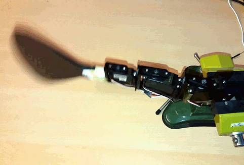

# RoFish

*RoFish_cpg* is an example sketch for the Arduino to show the implementation of a Central Pattern Generator (CPG) for the  locomotion control of a robotic fish. The CPG from the example *RoFish_cpg* has three coupled oscillators for driving an equal number of joints of the robotic fish. The frequency of the oscillations, amplitude and the offset (used for steering), are controllable via a terminal console, connecting to the Arduino UART. The swimming gait can be switched from forward to backward direction.
This example is not prepared for remote control applications. 

The used type of RC-servo motor for joints 1 and 2, is the Futaba S3003. The tail motor is a Futaba S3102.
